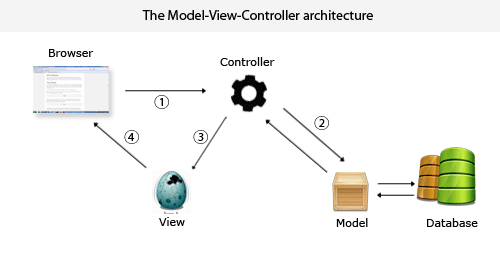

[](https://confluence.jetbrains.com/display/ALL/JetBrains+on+GitHub)
[](https://www.apache.org/licenses/LICENSE-2.0)
[](https://search.maven.org/artifact/org.jetbrains.kotlinx/kotlinx-knit/0.2.2/pom)

[](https://ge.jetbrains.com/scans?search.rootProjectNames=Kotlin)

[](https://www.travis-ci.com/Relesi/inteligent-integrated)

## Integrated Guide


**Using gradle?** See [gradle example](https://github.com/Relesi/inteligent-integrated/tree/master/gradle/wrapper)


### Gradle Setup 🐘

This template is using [**Gradle Kotlin DSL**](https://docs.gradle.org/current/userguide/kotlin_dsl.html) as well as the [Plugin DSL](https://docs.gradle.org/current/userguide/plugins.html#sec:plugins_block) to setup the build.

Dependencies are centralized inside the [Dependencies.kt](buildSrc/src/main/java/Dependencies.kt) file in the `buildSrc` folder. This provides convenient auto-completion when writing your gradle files.

### Travis Setup

Add to your `.travis.yml` file.
```yml
language: java
after_success:
  - bash <(curl -s https://codecov.io/bash)
  
 Private Repos
  - Add to your `.travis.yml` file.

```

#### Add Jacoco Plugin
```xml
<plugin>
  <groupId>org.jacoco</groupId>
  <artifactId>jacoco-maven-plugin</artifactId>
  <version>0.7.9</version>
  <executions>
    <execution>
      <goals>
        <goal>prepare-agent</goal>
      </goals>
    </execution>
    <execution>
      <id>report</id>
      <phase>test</phase>
      <goals>
        <goal>report</goal>
      </goals>
    </execution>
  </executions>
</plugin>
```

#### 2.2. Setup

- First, let’s create a Spring Boot 2 project and modify the POM to contain entries specifying the versions of Java and Kotlin with the dependencies:

```xml
<dependency>
    <groupId>org.jetbrains.kotlin</groupId>
    <artifactId>kotlin-stdlib-jre8</artifactId>
    <version>1.2.71</version>
</dependency>
<dependency>
    <groupId>org.jetbrains.kotlin</groupId>
    <artifactId>kotlin-reflect</artifactId>
    <version>1.2.71</version>
</dependency>
<dependency>
    <groupId>com.fasterxml.jackson.module</groupId>
    <artifactId>jackson-module-kotlin</artifactId>
    <version>2.9.9</version>
</dependency>


```


- Take note that we are specifying file locations for our Kotlin source and test files:
```xml
<sourceDirectory>${project.basedir}/src/main/kotlin</sourceDirectory>
<testSourceDirectory>${project.basedir}/src/test/kotlin</testSourceDirectory>

```


- If our Kotlin files are in different locations, you will need to modify these entries in the POM.

- To compile Kotlin modules and sources, we need to use kotlin-maven-plugin:

```xml

<plugin>
    <artifactId>kotlin-maven-plugin</artifactId>
    <groupId>org.jetbrains.kotlin</groupId>
    <version>1.1.2</version>
    <configuration>
        <compilerPlugins>
            <plugin>spring</plugin>
        </compilerPlugins>
        <jvmTarget>1.8</jvmTarget>
    </configuration>
    <executions>
        <execution>
            <id>compile</id>
            <phase>compile</phase>
            <goals>
                <goal>compile</goal>
            </goals>
        </execution>
        <execution>
            <id>test-compile</id>
            <phase>test-compile</phase>
            <goals>
                <goal>test-compile</goal>
            </goals>
        </execution>
    </executions>
    <dependencies>
        <dependency>
            <groupId>org.jetbrains.kotlin</groupId>
            <artifactId>kotlin-maven-allopen</artifactId>
            <version>1.1.2</version>
        </dependency>
    </dependencies>
</plugin>


```

### Dokka

- You can run Dokka from the command line or as part of your Ant, Maven, or Gradle build script. The recommended way to run Dokka is to add it to the Gradle build script for your module. Here’s the minimum required configuration of Dokka in a Gradle build script:


#### Controller

https://spring.io/guides/tutorials/spring-boot-kotlin/




Development...
    
